# Swarm Ionospheric Analyzer


## Система автоматизированного поиска ионосферных предвестников землетрясений

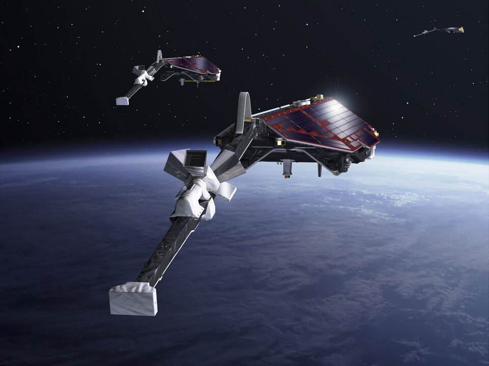

Проект посвящен разработке инструмента на Python для анализа данных спутниковой миссии ESA Swarm. Основная задача — выделение аномалий в ионосфере, которые могут предшествовать сильным сейсмическим событиям.

Современные исследования показывают, что в ионосфере могут происходить аномальные изменения перед сильными сейсмическими событиями. Механизмы этих эффектов остаются предметом научного обсуждения, а надежные методы выделения сейсмических предвестников в ионосфере ещё не сформированы.

Цель проекта - создать инструмент, который позволяет по заданным координатам и дате события автоматически загружать спутниковую телеметрию, проводить статистический анализ и визуализировать аномалии, потенциально связанные с литосферными процессами.

## Особенности:
* End-to-End автоматизация: весь цикл (загрузка -> обработка -> визуализация) выполняется вызовом одной функции.
* Server-side оптимизация: фильтрация данных на стороне серверов ESA.
* Робастная статистика: использование медианы и IQR (в отличие от среднего значения, медиана устойчива к одиночным выбросам).
* Мультипараметрический анализ: одновременная обработка данных плазмы (EFI) и навигационных параметров (TEC/ROTI).

## Технологический стек:
* Data Сollection: `viresclient` (API для доступа к данным ESA VirES)
* Processing: `Pandas`, `NumPy` (очистка, фильтрация, ресэмплинг, расчет геометрии и др.)
* Analytics: статистический критерий ($M±k\bullet IQR$)
* Validation: сверка с индексом Kp, корреляционный анализ между аппаратами созвездия
* Visualization: `Matplotlib`

## Логика работы пайплайна:
### 1. Сбор данных.
Загрузка данных реализована через API сервиса VirES Европейского космического агенства. Система загружает данные в заданном радиусе (по умолчанию ±10°) от эпицентра. Извлекаются данные с двух приборов:
* Зонд Ленгмюра EFI: физические параметры плазмы (электронная плотность $N_e$, температура электронов $T_e$, концентрация ионов $N_i$ и потенциал аппарата $V_s$).
* GNSS-приемники: данные вертикального полного электронного содержания VTEC и рассчитанного индекса турбулентности ROTI.
    
### 2. Предобработка.
Поток данных разбивается на отдельные орбитальные пролеты. Данные разделяются на дневные и ночные по местному времени. Это важно, так как днем солнечная ионизация зашумляет данные, а ночью солнечный источник исчезает и любые возмущения проявляются заметнее. Данные разделяются по орбитальным пролетам над зоной интереса, для каждого пролета рассчитывается расстояние до эпицентра.

### 3. Анализ орбитальных пролетов.
Для каждого пролета строятся графики измеренных параметров. Это позволяет анализировать, как они изменяются при сближении и удалении от области землетрясения. Такая визуализация позволяет увидеть локальные изменения параметров – резкие скачки или искажения формы кривых и используется для первичного визуального анализа.
#### Пример запуска функции для визуализации параметров плазмы (EFI) по орбитальным пролетам:
```python
plot_efi_passes(latitude=52.8, longitude=160.1, date='2025-07-29', satellite='C')
```

### 4. Анализ среднесуточных измерений.
Данные усредняются по суткам, чтобы отделить регулярные суточные изменения от возможных возмущений и анализируются относительно дня события. Границы нормального диапазона определяются на основе медианы M и межквартильного интервала IQR.
#### Пример запуска анализа данных полного электронного содержания (GNSS):
```python
analyze_event_tec(latitude=52.8, longitude=160.1, event_date_='2025-07-29', satellite='A')
```

### 5. Валидация.
Чтобы исключить ложноположительные результаты, проводится:
* Анализ индекса Kp, это позволяет убедиться, что выявленные отклонения в ионосфере наблюдаются при спокойной геомагнитной обстановке и не связаны с солнечной активностью.
* Кросс-валидация. Аппараты A и C движутся на близких высотах и проходят выбранный регион в одно и то же местное время, спутник B летит выше. Если корреляция между измерениями низкая, изменения носят скорее локальный характер. Если корреляция высокая, это указывает на пространственно-протяженные возмущение, которые регистрируются несколькими аппаратами.

## Результаты работы

### Коротко:
В ходе тестирования системы на сильнейших землетрясениях 2025 года (Камчатка Mw 8.8, Мьянма Mw 7.7) были выявлены значимые аномалии электронной плотности ($N_e$), температуры ($T_e$), VTEC за 5–17 дней до сейсмических толчков. Корреляция между аппаратами A и C по плотности электронов достигла 0.96–1.0, что доказывает достоверность алгоритмов обработки. Низкая корреляция со спутником Swarm B (летящим выше) указала на ограниченную вертикальную протяженность сейсмогенных возмущений.

### Подробно:
<details>
<summary><h3>Кейс 1. Землетрясение на Камчатке 30 июля 2025 года</h3></summary>
Сильнейшее землетрясение 2025 года. По моментной магнитуде его сила составила Mw 8,8, что делает его одним из сильнейших за всю историю инструментальных наблюдений. Эпицентр располагался в 120-140 км от Петропавловска-Камчатского, гипоцентр - на глубине около 35 км. Землетрясение произошло в районе, где Тихоокеанская плита движется под территорию Камчатки. Её постепенное погружение вглубь земной коры приводит к накоплению напряжений, которые периодически разряжаются в виде сильных подземных толчков. Несмотря на очень большую силу, ущерб оказался относительно небольшим. На Камчатке и Курильских островах были зафиксированы повреждения инфраструктуры, трещины в зданиях и перебои со связью, однако разрушений, характерных для землетрясений такой силы, удалось избежать.

При прохождении аппарата С над регионом в день события зафиксированы локальные неоднородности плазмы:

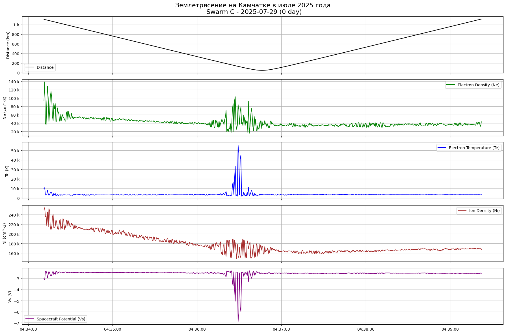

На графике по данным прибора EFI видно постепенное снижение электронной плотности, нормальное для утренних часов, но на фоне общего тренда появляются короткие участки неустойчивости, совпадающие по времени с резкими изменениями других параметров. Заметны выраженные всплески электронной температуры, её значение кратковременно возрастает в несколько раз по сравнению с фоновым уровнем. Эти скачки сопровождаются синхронными провалами потенциала КА. Такое совпадение максимумов и минимумов характерно для локальных неоднородностей плазмы, когда концентрация и температура электронов изменяются резко, баланс токов на поверхности КА нарушается, что приводит к изменению измеренного потенциала.

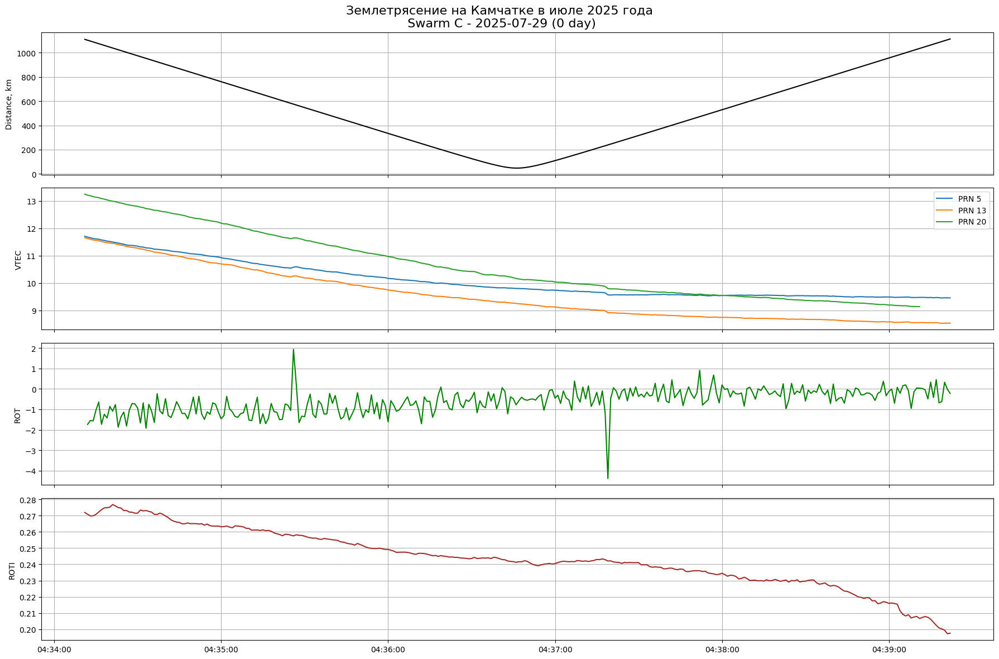

График VTEC по данным GNSS-приемника показывает плавное изменение значений вдоль траектории, что соответствует спокойному состоянию ионосферы. График ROTI демонстрирует низкие значения индекса, что указывает на отсутствие широкомасштабных возмущений. Разница с данными EFI объясняется масштабом измерений. TEC показывает общую картину, суммарное содержание электронов по всей толще ионосферы, а зонд Ленгмюра фиксирует мелкомасштабные изменения плазмы непосредственно в точке КА.

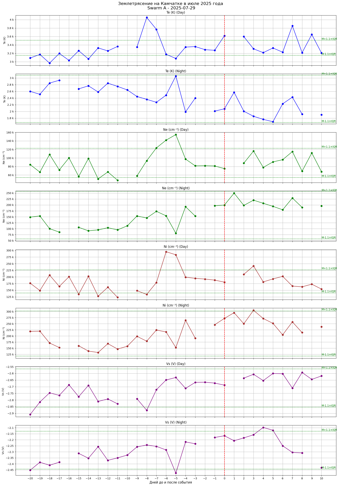

По данным Swarm A, в дневных значениях температуры электронов  Te  видны сильные отклонения за 8 и 5 дней до землетрясения, в день землетрясения и через 2 дня после. Ночные значения остаются в пределах нормы, но небольшое увеличение отмечается за 5 дней до события.
В измерениях среднесуточной плотности электронов  Ne  заметное повышение дневной плотности наблюдается за 6 и 5 дней до и 3 дня после события, отклонение от нормы также заметно за 8 и 11 дней до. Ночные значения превышают верхний порог также на 3 день после землетрясения.
Потенциал аппарата  Vs  для дневных проходов показывает смещение к более отрицательным значениям за 20 дней до события. Ночные значения демонстрируют провал за 5 дней, который выходит за нижний порог нормальных значений и отклонения через 4 и 5 дней после события.

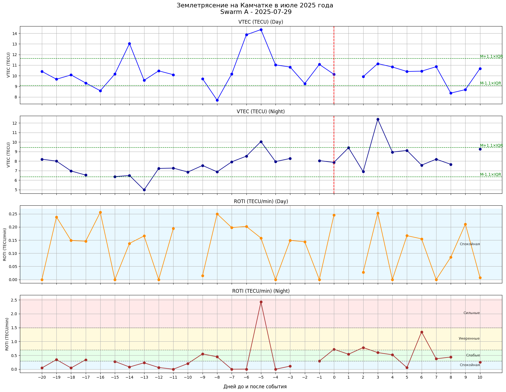

По данным Swarm A наблюдаются выраженные отклонения VTEC как в дневных, так и в ночных измерениях. Дневные значения VTEC превышают верхнюю границу нормального диапазона за 14, 6 и 5 дней до события, и ниже нижнего порога - за 16 и 8 дней, а также на 8 и 9 день после землетрясения. В ночных измерениях VTEC превышает нормальный диапазон за 5 дней до и 3 дня после, а также показывает значение на границе нормы в день после события.
Индекс ROTI демонстрирует устойчиво спокойное состояние днем, значения не превышают 0,25. В ночных данных, напротив, отмечаются эпизоды нестабильности: умеренные возмущения зафиксированы в день, через день и через 6 дней, а за 5 дней до события индекс достигает уровня, соответствующего сильным возмущениям.

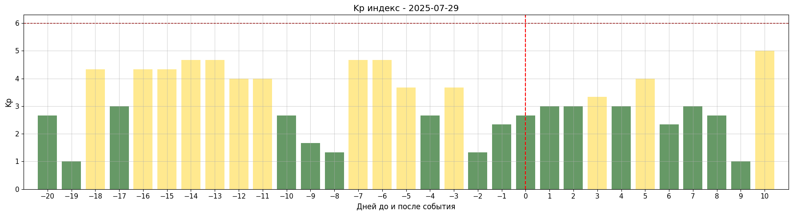

Индекс Kp не достигал критических значений, оставаясь на низком уровне. Это позволяет считать, что выявленные аномалии в ионосфере связаны не с внешними космическими факторами, а с процессами, предшествующими землетрясению.

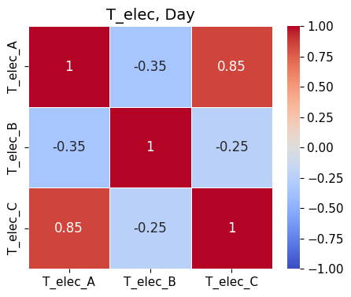
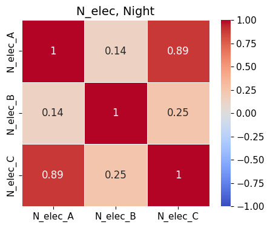
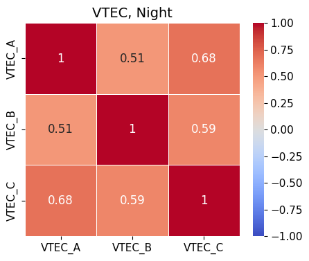

Корреляционный анализ показал, что аппараты A и C дают наиболее согласованные результаты. Более низкая корреляция с КА B согласуется с его другой траекторией и высотой, что указывает на пространственную неоднородность ионосферных возмущений: область аномалий оказывается достаточно компактной вертикально и по широте, чтобы быть хорошо зарегистрированной A и C, но уже слабее «перекрываться» с зоной наблюдений B.
</details>

<details>
<summary><h3>Кейс 2. Землетрясение в Мьянме 28 марта 2025 года</h3></summary>
Мощное землетрясение в центральной части Мьянмы, недалеко от города Мандалай. Его моментная магнитуда составила Mw 7,7, по последствиям оно стало самым разрушительным землетрясением 2025 года. Подземный толчок произошёл в зоне активного азлома, проходящего через густонаселенные районы. Сильные колебания ощущались по всей Мьянме, в Таиланде, Бангладеш, Китае, Индии, Лаосе и Вьетнаме. Мандалай и близлежащие районы понесли наибольший ущерб: были разрушены жилые здания, мосты, объекты инфраструктуры. В Таиланде, особенно в Бангкоке, пострадали высотные здания из-за особенностей местного грунта.

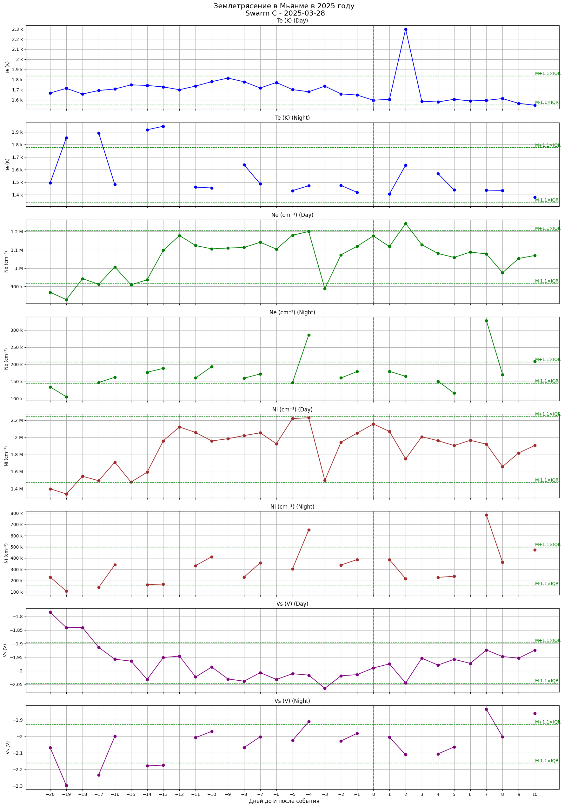

В среднесуточных изменениях параметров EFI по данным Swarm C отклонения наблюдаются в температуре электронов, в дневных данных фиксируется выраженный пик через 2 дня после землетрясения, в ночных значениях отклонения отмечаются также за 17, 14 и 13 дней до события.
Ночная плотность электронов демонстрирует аномальные значения за 17 и 4 дня до события и через 7 дней после.
В измерениях потенциала аппарата заметны отклонения -18 и -3 дни для дневного времени суток. В ночных данных значимых выбросы присутствуют за 17, 14, 13 и 4 дня до и 7 дней после землетрясения.


По данным GNSS-приёмника того же аппарата дневной VTEC демонстрирует повышенные значения за 4 дня до, в первый день после землетрясения, а также за 17, 15 и 3 дня до события значения лежат ниже нормальной границы. В ночных измерениях также отмечаются превышения нормы в -4 и 7 дни.
В дневных значениях индекса ROTI уже за 12-8 дней до землетрясения фиксируются эпизоды сильных возмущений, после чего аналогичные пики повторяются за 5 и 2 дня до события, после землетрясения умеренные и сильные возмущения отмечаются в 1, 3, 6 и 9 дни. Ночные значения ROTI остаются преимущественно низкими, что характерно для более стабильной ночной ионосферы. Существенное отклонение отмечается только на 7 день после события, когда регистрируется уровень умеренных возмущений.

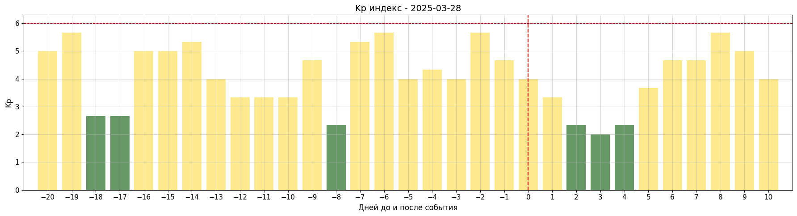

Значения индекса Kp колеблются в пределах около 3-5, но ни разу не достигают уровня 6, таким образом, внешних космических факторов, способных вызвать крупные ионосферные отклонения, в этот интервал не наблюдалось, и зафиксированные аномалии могут рассматриваться на фоне умеренно спокойной геомагнитной обстановки.

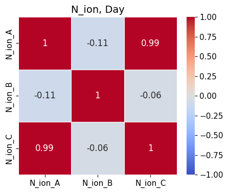
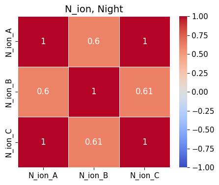

В дневных данных высокая согласованность наблюдается только между аппаратами Swarm A и C, тогда как корреляция с B близка к нулю. В ночных данных связь с B возрастает – до 0,60 и 0,61. Это означает, что ночью структура ионосферных вариаций была более однородной по высоте и одновременно попадала в зоны наблюдений всех трех КА. Таким образом, корреляционный анализ показывает выраженную дневную локальность и, наоборот, ночную протяженность аномалий по высоте.
</details>
